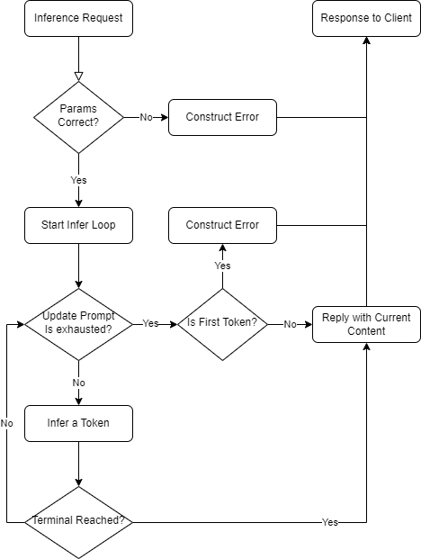

#

## Inference API

So inference is here. `web-rwkv-axum`'s inference is more like something you'd expect from a normal infer loop, you have states, transformers, samplers etc.

To ensure the efficiency of inference and reduce the payload when inferring, `web-rwkv-axum` lets you to construct needed components via other APIs, and finally assemble them into an infer pipeline which should suit your need in most of the cases.

So, in an infer request, `web-rwkv-axum` will do as the following:

1. Exams the params to ensure things are correctly assembled.
2. Start the infer loop.
3. Update the `logits transformers`/`sampler` specified by the request with the prompt.
4. If any of them is exhausted, response with error since infer will be impossible to start.
5. Start the inference, infer a token, pass it to transformers and sampler to get a token sampled.
6. Check if the generated content meets the `terminal`, if yes, reply with content currently generated.
7. If no, update the `logits transformers`/`sampler` with the token.
8. If any of them is exhausted, response with content currently generated.
9. Pass the token to step `5` until inference is ended by `terminal` or `exhaustion`.

It might sounds scary, so a workflow diagram is here:

### Continue or Stop?

An inference request can return even if you might have some more things to generate. For example, if the terminal is `infer only 32 tokens at max`, it will then only infer *32* tokens. However, you can always continue if you want to by sending another request.

Almost every component in `web-rwkv-axum`, including `state`, `sampler`, `transformer`, etc., are stateful. This means that they will **not** lose their internal states even if the infer request is done.

So, if you use the returned `last_token` as the prompt with the same pipeline setup, the inference will continue until next terminal or exhaustion is met.
